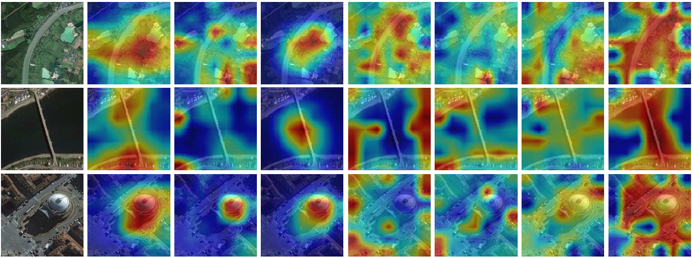
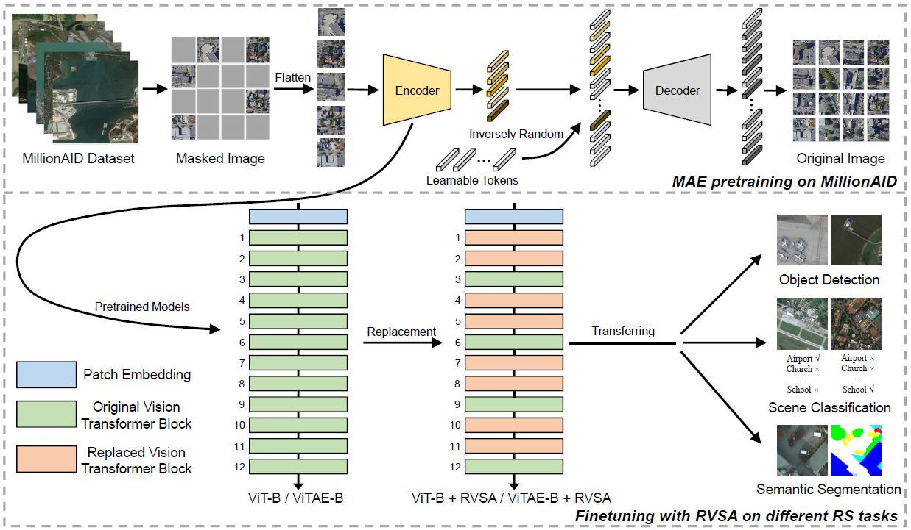
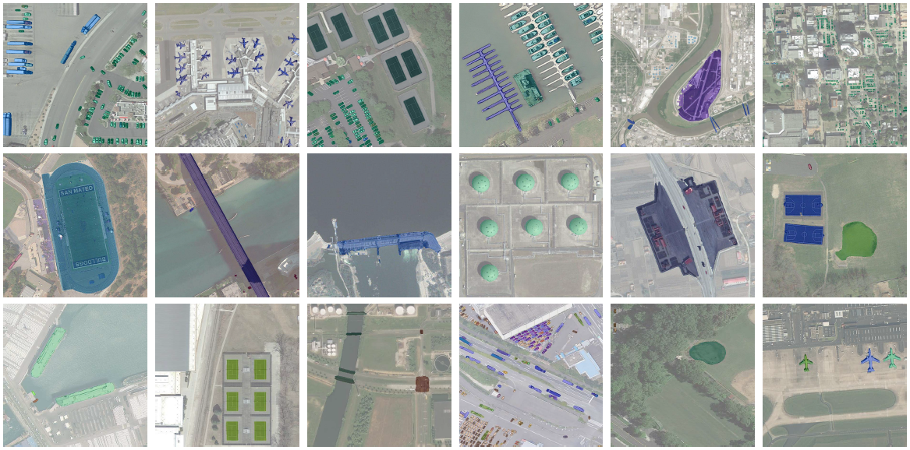
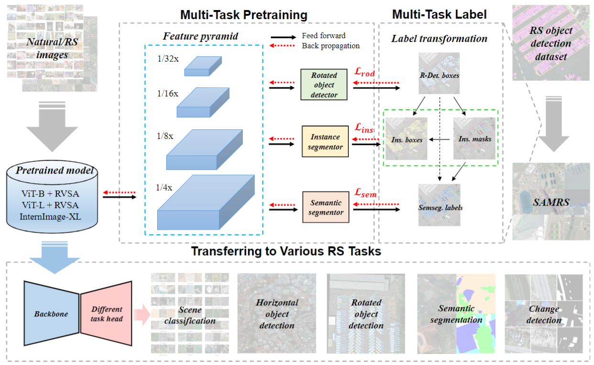
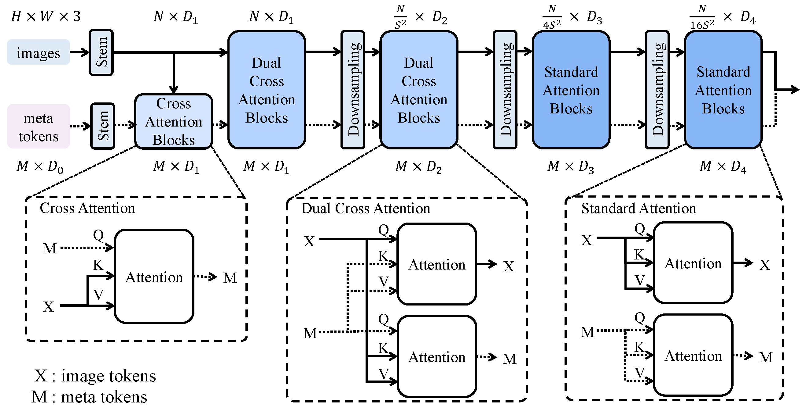

> ### :alarm_clock: The repo of the paper "An Empirical Study of Remote Sensing Pretraining" has been moved to [RSP](https://github.com/ViTAE-Transformer/RSP)
<h1 align="center">Remote Sensing</h1>

This repo contains a comprehensive list of our research works related to **Remote Sensing**. For any related questions, please contact <strong><a href="https://dotwang.github.io">Di Wang</a></strong> at [wd74108520@gmail.com](mailto:wd74108520@gmail.com) or [d_wang@whu.edu.cn](mailto:d_wang@whu.edu.cn).

## Overview

[1. An Empirical Study of Remote Sensing Pretraining [TGRS-2022]](#rsp)

  

[2. Advancing Plain Vision Transformer Towards Remote Sensing Foundation Model [TGRS-2022]](#rvsa)

  

[3. SAMRS: Scaling-up Remote Sensing Segmentation Dataset with Segment Anything Model [NeurIPS-2023]](#samrs)

<a href="https://arxiv.org/abs/2305.02034">  

[4. MTP: Advancing Remote Sensing Foundation Model via Multi-Task Pretraining [arXiv-2024]](#samrs)

<a href="https://arxiv.org/abs/2403.13430">  

[5. LeMeViT: Efficient Vision Transformer with Learnable Meta Tokens for Remote Sensing Image Interpretation [IJCAI-2024]](#lemevit)

  

## Projects

### 📘 An Empirical Study of Remote Sensing Pretraining [TGRS-2022]

<em>Di Wang&#8727;, Jing Zhang&#8727;, Bo Du, Gui-Song Xia and Dacheng Tao</em>

[Paper](https://arxiv.org/abs/2204.02825) |  [Github Code](https://github.com/ViTAE-Transformer/RSP) | [BibTex](./assets/TGRS_2022_RSP/rsp.bib)

We train different networks from scratch with the help of the largest remote sensing scene recognition dataset up to now-MillionAID, to obtain the remote sensing pretrained backbones, including both convolutional neural networks (CNN) and vision transformers such as Swin and ViTAE, which have shown promising performance on computer vision tasks. Then, we investigate the impact of ImageNet pretraining (IMP) and remote sensing pretraining (RSP) on a series of downstream tasks including scene recognition, semantic segmentation, object detection, and change detection using the CNN and vision transformers backbones.

***

### 📘 Advancing Plain Vision Transformer Towards Remote Sensing Foundation Model [TGRS-2022]

<em>Di Wang&#8727;, Qiming Zhang&#8727;, Yufei Xu&#8727;, Jing Zhang, Bo Du, Dacheng Tao and Liangpei Zhang</em>.

[Paper](https://arxiv.org/abs/2208.03987) |  [Github Code](https://github.com/ViTAE-Transformer/Remote-Sensing-RVSA) | [BibTex](./assets/TGRS_2022_RVSA/rvsa.bib)

We resort to plain vision transformers with about 100M and make the first attempt to propose large vision models customized for RS tasks and propose a new rotated varied-size window attention (RVSA) to substitute the original full attention to handle the large image size and objects of various orientations in RS images. The RVSA could significantly reduce the computational cost and memory footprint while learn better object representation by extracting rich context from the generated diverse windows.

***

### 📘 SAMRS: Scaling-up Remote Sensing Segmentation Dataset with Segment Anything Model [NeurIPS-2023]

<em>Di Wang, Jing Zhang, Bo Du, Minqiang Xu, Lin Liu, Dacheng Tao and Liangpei Zhang</em>.

[Paper](https://arxiv.org/abs/2305.02034) |  [Github Code](https://github.com/ViTAE-Transformer/SAMRS) | [BibTex](./assets/arXiv_2023_SAMRS/samrs.bib)

In this study, we leverage <a href="https://arxiv.org/abs/2304.02643"> SAM </a> and existing RS object detection datasets to develop an efficient pipeline for generating a large-scale RS segmentation dataset, dubbed SAMRS. SAMRS surpasses existing high-resolution RS segmentation datasets in size by several orders of magnitude, and provides object category, location, and instance information that can be used for semantic segmentation, instance segmentation, and object detection, either individually or in combination. We also provide a comprehensive analysis of SAMRS from various aspects. We hope it could facilitate research in RS segmentation, particularly in large model pre-training.

***

### 📘 MTP: Advancing Remote Sensing Foundation Model via Multi-Task Pretraining [arXiv-2024]

<em>Di Wang, Jing Zhang, Minqiang Xu, Lin Liu, Dongsheng Wang, Erzhong Gao, Chengxi Han, Haonan Guo,  Bo Du, Dacheng Tao and Liangpei Zhang</em>.

[Paper](https://arxiv.org/abs/2403.13430) |  [Github Code](https://github.com/ViTAE-Transformer/MTP) | [BibTex](./assets/arxiv_2024_MTP/mtp.bib)

In this study, we explore the Multi-Task Pretraining (MTP) paradigm for RS foundation models. Using a shared encoder and task-specific decoder architecture, we conduct multi-task supervised pretraining on the SAMRS dataset, encompassing semantic segmentation, instance segmentation, and rotated object detection. MTP supports both convolutional neural networks and vision transformer foundation models with over 300 million parameters. The pretrained models are finetuned on various RS downstream tasks, such as scene classification, horizontal and rotated object detection, semantic segmentation, and change detection. We hope this research encourages further exploration of RS foundation models and anticipate the widespread application of these models across diverse fields of RS image interpretation.

***

### 📘 LeMeViT: Efficient Vision Transformer with Learnable Meta Tokens for Remote Sensing Image Interpretation [IJCAI-2024]

<em>Wentao Jiang, Jing Zhang, Di Wang, Qiming Zhang, Zengmao Wang and Bo Du</em>.

[Paper]() |  [Github Code](https://github.com/ViTAE-Transformer/LeMeViT) | [BibTex](./assets/IJCAI_2024_LeMeViT/lemevit.bib)

In this study, we proposes to use learnable meta tokens to formulate sparse tokens, which effectively learn key information meanwhile improving the inference speed. We propose Dual Cross-Attention (DCA) to promote information exchange between image tokens and meta tokens, where they serve as query and key (value) tokens alternativelyin a dual-branch structure, significantly reducingthe computational complexity compared to self-attention. Experimental results in classification and dense prediction tasks show that LeMeViT has a significant speedup, fewer parameters, and competitive performance, and achieves a better trade-off between efficiency and performance. We hope this research will advance the development of efficient RS models and facilitate the practical application of foundation models.

